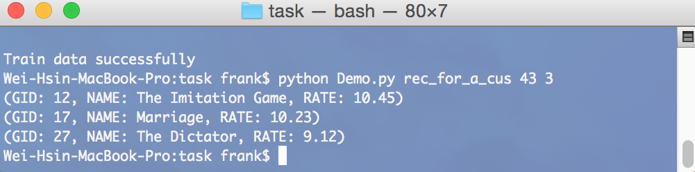

## Introduction
RecommendationAPI is a program for recommendation systems and applications, e.g., recommending products which customers have not yet rated. This program is based on "matrix factorization", "linear regression" and "stochastic gradient descent". In order to facilitate demo, the APIs need to be manipulated by terminal. However, it is easy to transform it to WebAPIs by slightly modifing the code in Demo.py.

## Requirement setup
* Python 2.7 or Python 3.4
* Numpy
* sqlalchemy

## Recommend software but not necessary
 * sqliteBrowser
 
## Instructions of APIs
1. Storing raw data

	* First, it is necessary to store bulk rating records from customers. The format of input record is "txt" and each column is seperated by a "tab". If one customer does not rate one specific product, you do not type anything in that cell.
	
	* Example of input file
	
		```
		Timestamp	Name	The Averagers	BirdMan	
	2015/05/05	Frank		5
	2015/05/05	Andy	5	5
	2015/05/07	Allen	5	5
		```

	* Commands in terminal
	
		```
		cd "the position of task in this program"
		python Demo.py save_raw_data ../data/raw.txt
		```
		
	* Example commands
	
		```
		cd /Users/frank/Documents/RecommendationAPI/rspy/task
		python Demo.py save_raw_data ../data/raw.txt
		```
		
2. Initially calculating

	* After storing raw data, you can start to extract implicit information from it and use this information to predict customers' preference for each products.

	* When calling this API, it is necessary to type two parameters, "the number of neuron" and "the number of iteration step", in sequence. This two parameters are quite important for the result. It may has unfavourable precision when one of this parameters is too large or too small; thus, you need to find the best parameters by trial-and-error or cross validation.
	
	* Commands in terminal
	
		```
		cd "the position of task in this program"
		python Demo.py train "number of neuron" "number of iteration step"
		```
		
	* Example commands
	
		```
		cd /Users/frank/Documents/RecommendationAPI/rspy/task
		python Demo.py train 8 50000
		```
		
3. Recommending products for a specific customers

	* All implicit information is extracted from the rating records; thus, you can start to recommend unrated products for customers.

	* When calling this API, you should type two parameters, "ID of a customer" and "number of recommended products for this customer" 
	
	* Commands in Terminal
	
		```
		cd "the position of task in this program"
		python Demo.py rec_for_a_cus "ID of a customer" "number of recommended products for this customer"
		```
	
	* Example commands
	
		```
		cd /Users/frank/Documents/RecommendationAPI/rspy/task
		python Demo.py rec_for_a_cus 43 3
		```
		
	* Example output
		 
			
4. adding new products

	* This program also provide update APIs. The input format is "txt" file which content is "JSON" array. 
		
	* Example of input file
	
		```
		[“Inside Out”, “Ant-Man”]
		```
		
	* Commands in Terminal
		
		```
		cd "the position of task in this program"
		python Demo.py add_goods ../data/new_goods.txt
		```
		
	* Example commands
		
		```
		cd /Users/frank/Documents/RecommendationAPI/rspy/task
		python Demo.py add_goods ../data/new_goods.txt
		```
		
5. Adding a new customer
	*	The input format is "txt" which content is "JSON" format.

	* When adding a new customer, the program will partially recalculate implicit information by stochastic gradient descent to improve the precision of prediction.
	
	* Example of input file

		```
		[{"GID": 1, "RATE":5},
		{"GID": 3, "RATE":6},
		{"GID": 14, "RATE":1},
		{"GID": 16, "RATE":3},
		{"GID": 21, "RATE":9}]
		```
		
	* Commands in terminal
	
		```
		cd "the position of task in this program"
		python Demo.py add_a_cus ../data/new_cus.txt
		```
		
	* Example commands
	
		```
		cd /Users/frank/Documents/RecommendationAPI/rspy/task
	python Demo.py add_a_cus ../data/new_cus.txt
		```
		
6. Updating the name/rating-records of a customer
	*	The input format is "txt" which content is "JSON" format.

	* When updating a customer, the program will partially recalculate implicit information by stochastic gradient descent to improve the precision of prediction.
	
	* Example of input file

		```
		{“ID”: 43,
		"NAME":"new name", 
		"DATA":	[{"GID": 25, "RATE":1},
				{"GID": 26, "RATE":1},
				{"GID": 27, "RATE":1}]}
		```

	* Commands in terminal
	
		```
		cd "the position of task in this program"
		python Demo.py update_a_cus ../data/update_cus.txt
		```
		
	* Example commands
	
		```
		cd /Users/frank/Documents/RecommendationAPI/task
		python Demo.py update_a_cus ../data/update_cus.txt
		```

